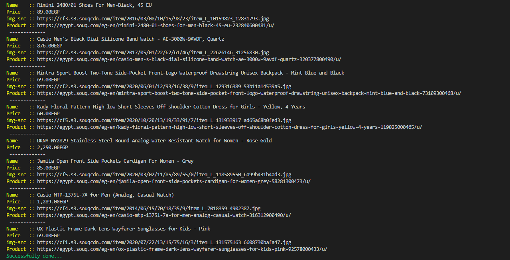

# RUBY-CAPSTONE

## Scruby ruby "Web-Scrapper"

This program can make scrapping to Souq.com E-commerce site. Just enter the products' page link and run!

# Screenshot 

## Built With

- Ruby
- Nokogiri gem
- HTTParty gem
- RSpec

### Prerequisites

- Terminal or cmdr for windows [install](https://cmder.net/)
- Ruby: follow installation instructions from here: [Install](https://www.ruby-lang.org/en/documentation/installation/)
- Install rspec following this guide: [Install](https://www.theodinproject.com/courses/ruby-programming/lessons/introduction-to-rspec)
- Gems: run => `gem install bundler`
- Nokogiri: run => `gem install nokogiri`
- HTTParty: run => `gem install httparty`
- Colorize: run => `gem install colorize`

### Usage

- Open your terminal or cmdr on windows.
- Clone the repository by: `git clone https://github.com/Mohamed-js/RUBY-CAPSTONE.git`
- `cd` to the directory of the project
- Run this command `ruby bin/scraper.rb`
- Enter the products page link of the `Souq.com` site.
- Try this demo link "https://deals.souq.com/eg-en/smart-tvs/c/15236"

### Run tests

- run `rspec` to run the tests

## Authors

👤 **Mohammed Atef**

- GitHub: [Mohammed Atef](https://github.com/Mohamed-js)
- Twitter: [@MohammedAtef](https://twitter.com/Demovejetta)
- LinkedIn: [LinkedIn](https://www.linkedin.com/in/mohamed-atef-032b6b1b0/) 

## 🤝 Contributing

Contributions, issues, and feature requests are welcome!

## Show your support

Give a ⭐️ if you like this project!

## Acknowledgments

- Microverse
- Notion
- HTTParty
- Nokogiri

## 📝 License

This project is [MIT](LICENSE) licensed.
