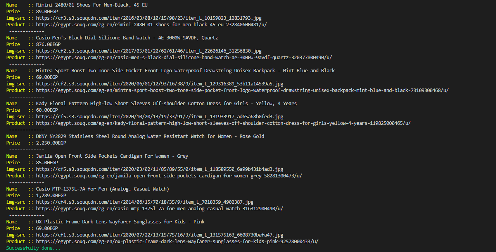

# RUBY-CAPSTONE

## Scruby ruby "E-commerce Web-Scrapper"

This program can make scrapping to any E-commerce site. Just enter the page information and run!

# Screenshot 

## Built With

- Ruby
- RSpec

## Getting Started

To get a local copy up and running follow these simple example steps.

### Install

Install ruby from here: [Install](https://www.ruby-lang.org/en/documentation/installation/)
Install rspec following this guide: [Install](https://www.theodinproject.com/courses/ruby-programming/lessons/introduction-to-rspec)

### Usage

- Open your terminal (CTRL + ALT + T) and clone the repository of this project.
- `cd` to the directory 
- Run this command `ruby bin/scraper.rb`
- Enter the link of the E-commerce site.
- Enter the element selectors of "name", "product page anchor tag", "img element of the product", "price element (p, a, div, etc...)"

### Run tests

- run `rspec` to run the tests

## Authors

👤 **Mohammed Atef**

- GitHub: [Mohammed Atef](https://github.com/Mohamed-js)
- Twitter: [@MohammedAtef](https://twitter.com/Demovejetta)
- LinkedIn: [LinkedIn](https://www.linkedin.com/in/mohamed-atef-032b6b1b0/) 

## 🤝 Contributing

Contributions, issues, and feature requests are welcome!

## Show your support

Give a ⭐️ if you like this project!

## Acknowledgments

- Microverse
- Notion

## 📝 License

This project is [MIT](LICENSE) licensed.
